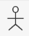
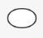
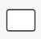
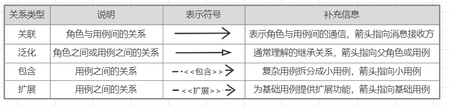
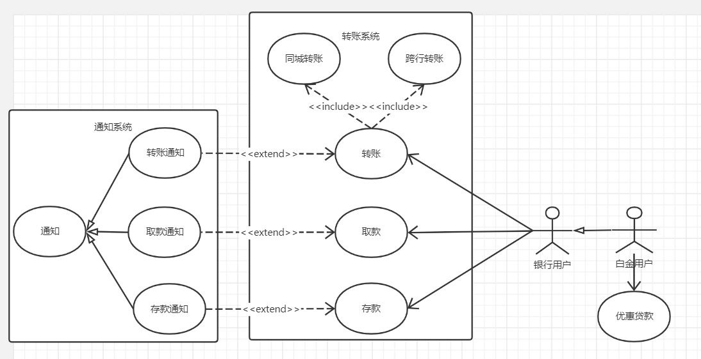

UML（Unified Modeling Language）：统一建模语言，为面向对象开发系统的产品进行说明、可视化、和编制文档的一种标准语言。

UML2.0一共有13种图形（UML1.5定义了9种，2.0增加了4种）
* 用例图：从用户角度描述系统功能。
* 类图：描述系统中类的静态结构。
* 对象图：系统中的多个对象在某一时刻的状态。
* 状态图：是描述状态到状态控制流，常用于动态特性建模
* 活动图：描述了业务实现用例的工作流程
* 顺序图：对象之间的动态合作关系，强调对象发送消息的顺序，同时显示对象之间的交互
* 协作图：描述对象之间的协助关系
* 构件图：一种特殊的UML图来描述系统的静态实现视图
* 部署图：定义系统中软硬件的物理体系结构
* 包图：对构成系统的模型元素进行分组整理的图（2.0新增）
* 组合结构图：表示类或者构建内部结构的图（2.0新增）
* 定时图：描述对象或实体随时间变化的状态或值，及其相应的时间或期限约束（2.0新增）
* 交互概览图：用活动图来表示多个交互之间的控制关系的图（2.0新增）

用例图：描述角色以及角色与用例之间的连接关系。说明的是谁要使用系统，以及他们使用该系统可以做些什么。  
用例图主要包含4个元素：
* 角色：表示与您的应用程序或系统进行交互的用户、组织或外部系统  
  
* 用例：外部可见的系统功能，对系统提供的服务进行描述  
 
* 容器：用来展示系统的一部分联系紧密的功能  
 
* 关系：用来表示角色、用例、容器三者之间的关系    
   
完整示例：  

